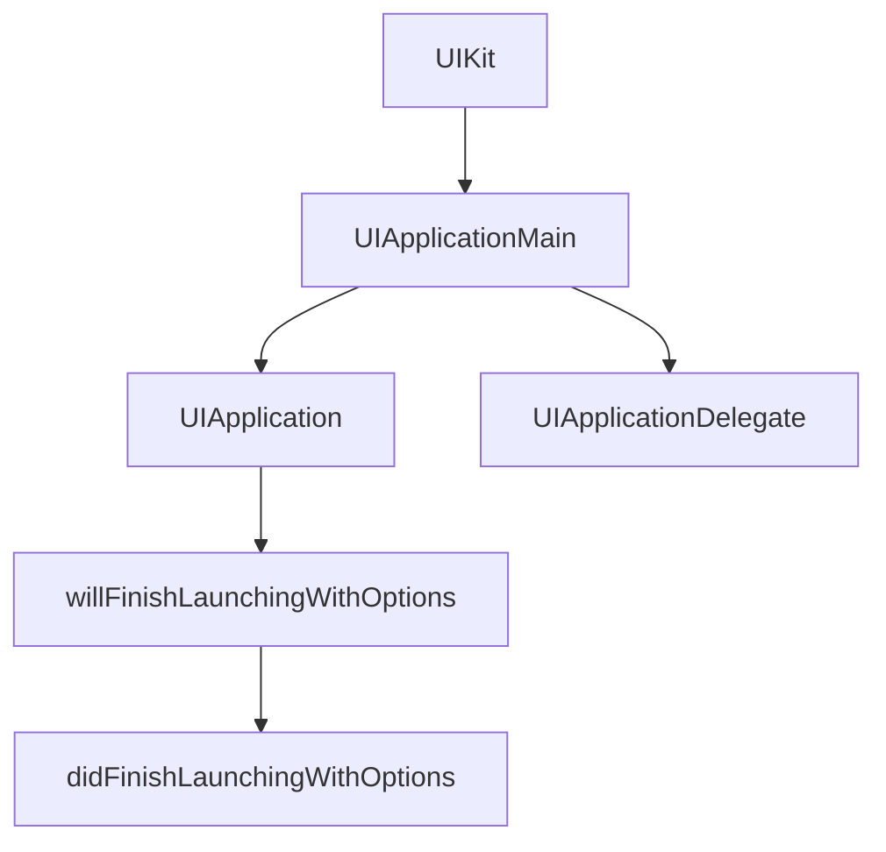
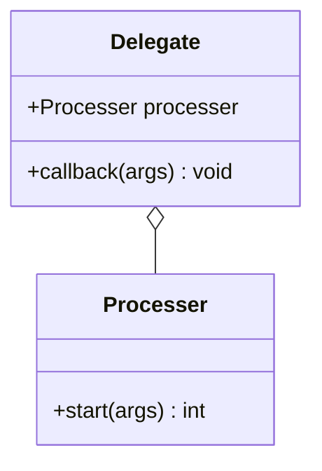
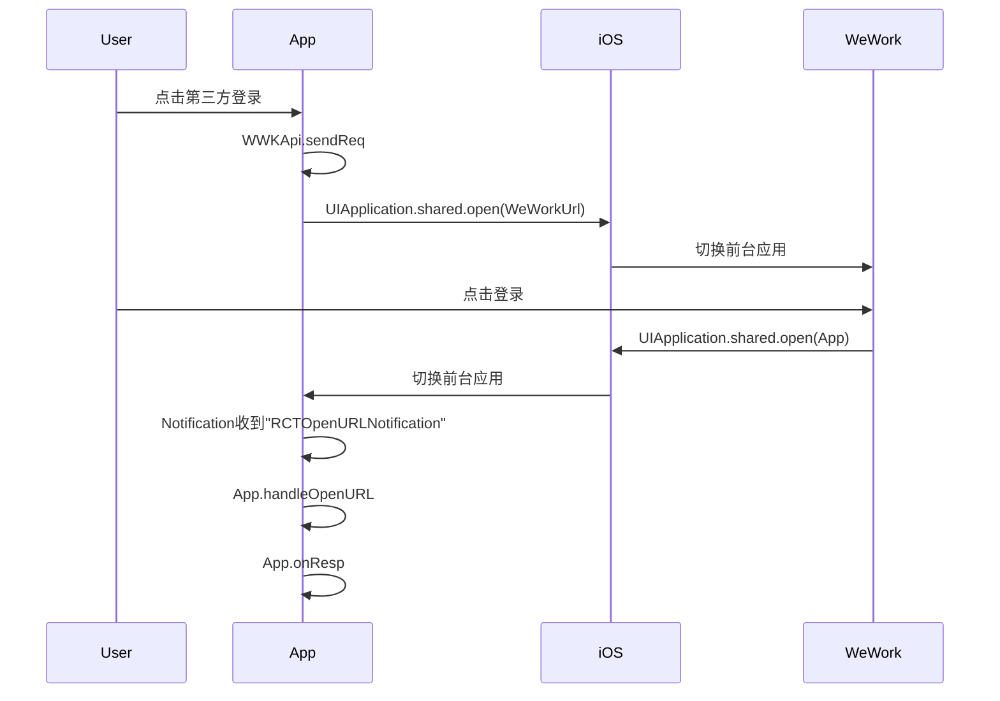
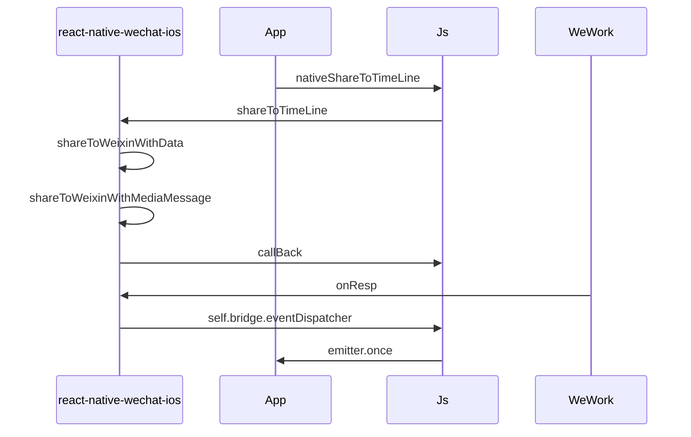

### ios 对象关系图

### ios 对象基本解释

- UIKit，用于 iOS 或者 tvOS 应用程序构建与管理图形化、事件驱动的用户界面框架。
- UIApplicationDelegate，协议，用于管理 App 的共享行为，App 的根对象。
- UIApplication，ios 中运行应用程序的几种控制和协调点。
- UIApplicationMain，ios 应用启动时，调用的第一个函数，会创建单例的 UIApplication 对象。

### delegate 机制

在 ios 中 delegate 相当于委托人，如初始类的 AppDelegate ，实现了 UIApplicationDelegate 方法，当中的 application:didFinishLaunchingWithOptions 方法，会在 UIKit 创建完成 UIApplication 后 回调触发。具体的类图如下:

### react-native 对接 企业微信

### react-native-wechat ios 逻辑

