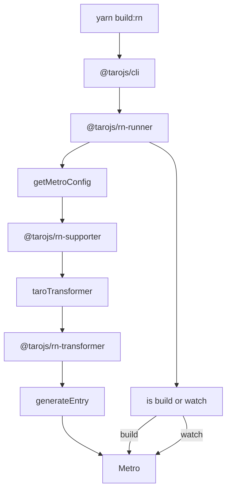
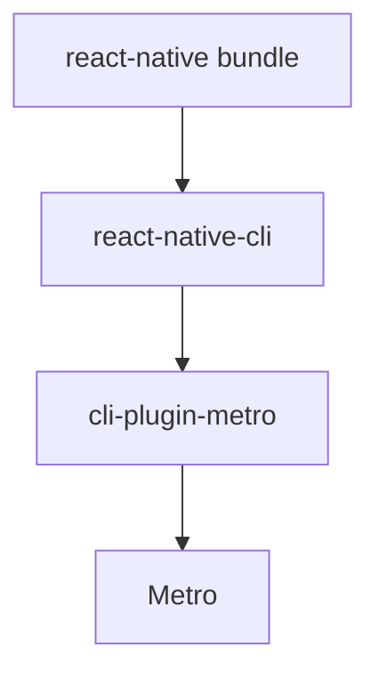

### taro 启动 ios 提示 `IPHONEOS_DEPLOYMENT_TARGET` 版本不对

- 错误原因： xcode 12 以上 `IPHONEOS_DEPLOYMENT_TARGET` 默认为 9.0 ~ 12.0, 部分依赖默认设置为 8.0

- 修复： 打开`ios/podfile`修改最下方代码如下

```ruby
  post_install do |installer|
    installer.pods_project.targets.each do |target|
        target.build_configurations.each do |config|
          config.build_settings.delete 'IPHONEOS_DEPLOYMENT_TARGET'
        end
    end
  end
```

### taro 不会自动编译 ios 端

- 现象： `yarn ios`报错，CpResource /XXX/XXX/ios/main.jsbundle 找不到

- 原因： `yarn dev:rn`和`yarn build:rn`命令都只编译安卓，taro-cli 的源码中`taro/packages/taro-cli/src/presets/platforms/rn.ts`代码

```javascript
export default (ctx: IPluginContext) => {
  ctx.registerPlatform({
    name: 'rn',
    useConfigName: 'rn',
    async fn ({ config }) {
      const { appPath, nodeModulesPath } = ctx.paths
      /**
       * 这里设定了deviceType为安卓
       **/
      const { deviceType = 'android', port, resetCache, qr } = ctx.runOpts.options
      const { npm } = ctx.helper
      printDevelopmentTip('rn')
      ...
    }
  })
}
```

- 解决： 先运行`yarn build:rn --platform ios`

### taro 报错 app 未注册

- 错误信息：

```
ERROR  Invariant Violation: "taroDemo" has not been registered. This can happen if:
* Metro (the local dev server) is run from the wrong folder. Check if Metro is running, stop it and restart it in the current project.
* A module failed to load due to an error and `AppRegistry.registerComponent` wasn't called.
Opening developer menu...
```

- 解决： yarn dev:rn --reset-cache

### taro 无法使用 `tsconfig.json` 中的 `baseUrl`和`paths`

- 安装依赖

```bash
$ yarn add babel-plugin-module-resolver
```

- `tsconfig.json`配置

```json
{
  ...
  "compilerOptions": {
    ...
    "baseUrl": ".",
    "paths": {
      "@tools/*": ["src/*"]
    }
  },
}

```

- `babelrc.js`配置

```javascript
/* eslint-disable import/no-commonjs */
// babel-preset-taro 更多选项和默认值：
// https://github.com/NervJS/taro/blob/next/packages/babel-preset-taro/README.md
module.exports = {
  ...
  plugins: [
    ...
    [
      "module-resolver",
      {
        root: ["./"],
        alias: {
          "@tools": "./src",
        },
      },
    ],
  ],
};
```

### 弹出层 Modal 在`@tarojs/components`中没有

- 可以使用`PageContainer`组件，taro 文档还未来得及更新，具体的属性可看[微信小程序](https://developers.weixin.qq.com/miniprogram/dev/component/page-container.html)

### 任何奇怪的错误，都先尝试清空缓存重启

- android

```
yarn dev:rn --reset-cache
yarn android
```

- ios

```
yarn dev:rn --reset-cache
yarn podInstall
yarn ios
```

### 安卓编译 apk 后安装白屏问题

- 错误情况： 安卓编译后安装 apk，打开白屏或者闪退

- `adb logcat -v time`调试

- 发现`ViewManager`的数组越界问题，可能原因为 taro 默认项目的 appId 和 android 工程文件的 appId 不匹配

- 修改项目中 appId 一致

AndroidManifest.xml

```xml
<manifest xmlns:android="http://schemas.android.com/apk/res/android"
  package="com.tarodemo">

```

MainActivity.java 和 MainApplication.java

```java
package com.tarodemo;
```

`MainActivity.java`和`MainApplication.java`所在的文件路径也为`java/com/tarodemo`下，参见 java 包的路径配置

- 再次编译，发现错误 `com.facebook.react.common.JavascriptException: Invariant Violation: "tarodemo" has not been registered`

- taro-rn 有模仿 expo 的行为，发现 expo 文档有[相关错误介绍](https://docs.expo.dev/troubleshooting/application-has-not-been-registered/)

- 修改 appName 和 MainComponent 一致

MainActivity.java

```java
  @Override
  protected String getMainComponentName() {
    return "tarodemo";
  }
```

config/index.js

```javascript
rn:
  {
    appName: "tarodemo",
    ...
  },
```

- 重新编译 `yarn build:rn --reset-cache`
- 在`android/app/src/main/assets/index.android.bundle`文件中搜索`AppRegistry.registerComponent`发现 appName 已经变化了

### 代码热更新

市面上已有的解决方案：

- [pushy](https://pushy.reactnative.cn/)
- [code-push](https://microsoft.github.io/code-push/)
- [jsPatch](https://github.com/bang590/JSPatch)

私有解决方案：

- 搭建私有的`code-push-server`，并通过微软的`code-push-cli@2.1.9`接入。

  [code-push-server](https://github.com/lisong/code-push-server)

  造成问题，code-push-server 版本 2.1.9，需要在 react-native 中 link，rn 在>=0.6 情况下，link 是自动进行的，rn<=0.6 的时候，link 不是自动的。

### taro-rn 代码编译流程



### react-native 命令行构建流程


