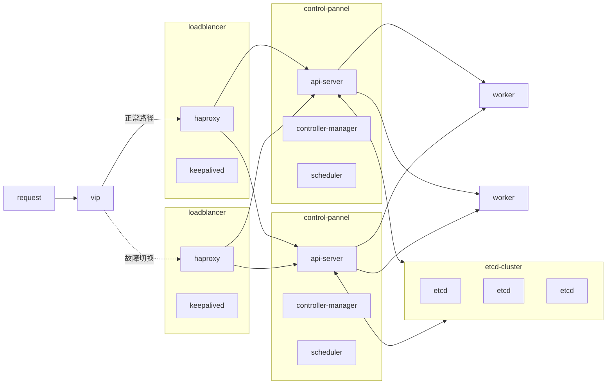
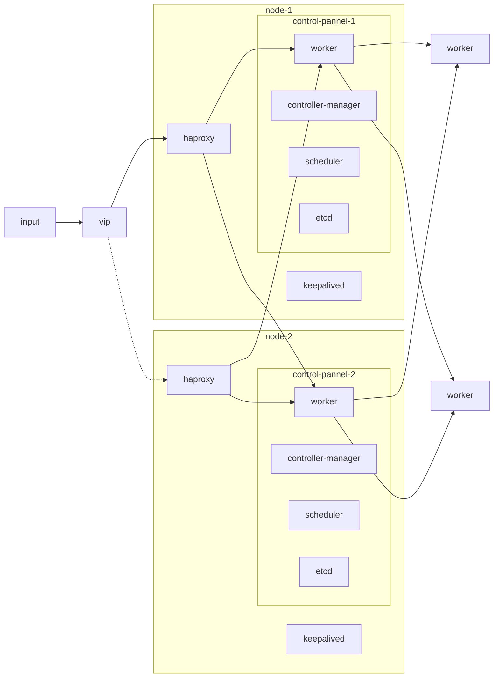
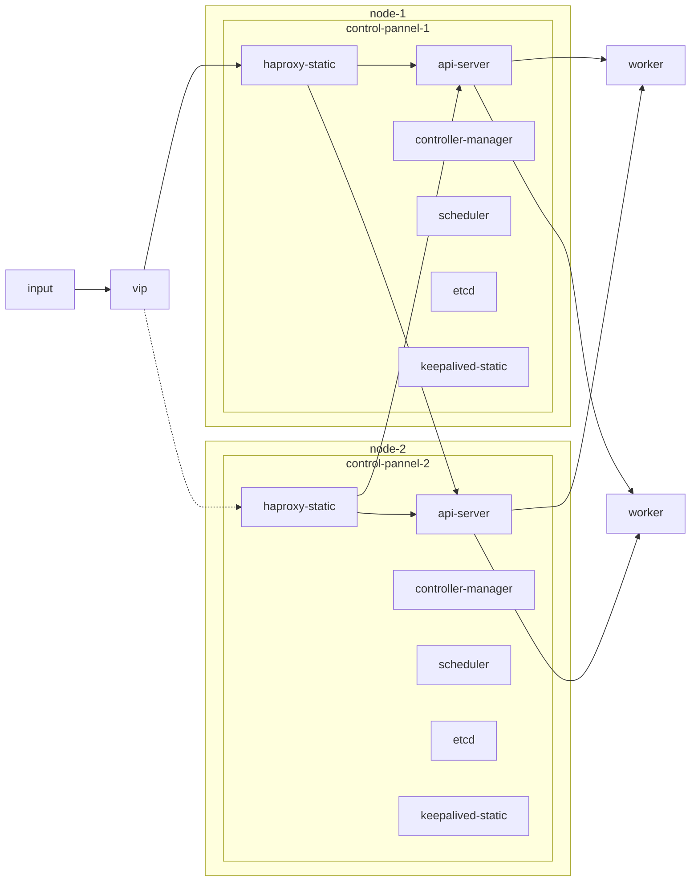
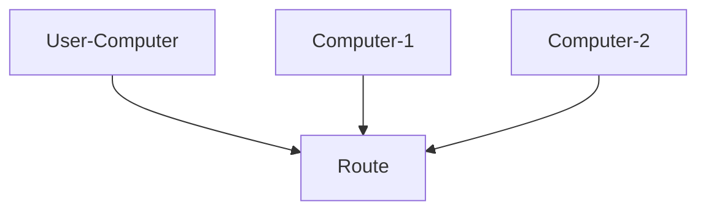

### 文档简介

本篇文档记录高可用`kubernetes`集群的基本概念和实现方式。

### 基本概念

高可用`kubernetes`集群用于产生在生产环境中防止`control-pannel`节点出现故障，用多台`control-pannel`节点来确保，在至少一台`control-pannel`不故障的情况下，整个集群都可以运行，并且可以随时进行故障切换。并且通过`load-balance`来确保`control-pannel`节点的负载均衡。

### 完整架构



- `VIP`为虚拟的`IP`，本身不要设置在计算机上，通过`keepalived`来实现，[原理](https://cloud.tencent.com/developer/article/1445076)
- `haproxy`用作`control-pannel`节点的负载均衡和接收`VIP`数据报文
- 这里`keepalived`和`haproxy`装在同一个节点上，作为`loadbalancer`使用
- `control-plane`单独安装在一个节点上
- 优点： 组件完全分离，安全和可靠性强，易于演示，学习和错误调试
- 缺点： 可能存在性能问题（多次反向代理），以及反向代理配置会比较繁琐，维护成本高

### 混合`lb`，`control-pannel`和`etcd`



- 相比较于上述的版本将`haproxy`和`keepalived`放在同一个节点上，可以减少维护成本，但是将`lb`和`control-plane`混合，`lb`挂的时候，可能`control-plane`一起挂掉。

### 更加简洁的方案



- 相比较于之前的版本将`haproxy`和`keepalived`放在`静态pod`中和`control-plane`一起启动，暂时没有尝试，但是更加简介的解决方法。
- [官网教程](https://github.com/kubernetes/kubeadm/blob/main/docs/ha-considerations.md#options-for-software-load-balancing)

### 搭建过程，针对上面的第二个版本

- 所需服务器

| 名称 |      ip      |     角色      |
| :--: | :----------: | :-----------: |
| dev3 | 172.29.1.122 | control-plane |
| dev4 | 172.33.1.50  |    worker     |
| dev6 | 172.29.1.41  | control-plane |
| dev7 | 172.29.1.42  | control-plane |
| vip  | 172.29.1.200 |    虚拟 ip    |

- 软件安装

对于`control-plane`的`node`，`dev3`、`dev6`、`dev7`执行如下:

```bash
  $ ssh <node-ip>
  $ apt update
  $ apt install keepalived
  $ apt install haproxy
  $ systemctl enable keepalived
  $ systemctl enable haproxy
```

- 配置`keepalived`

```bash

### keepalived.conf ###
! Configuration File for keepalived
global_defs {
  router_id ${ROUTE_ID} # 填写主机编号即可
}

vrrp_instance VI_1 {
  state ${STATE} # 主节点用 MASTER ，后备节点使用 BACKUP
  interface ens192 # ipconfig 查看对外上网用的网卡
  virtual_router_id 33 # 广播时候用的路由ID，对于多个节点，需要一样
  mcast_src_ip ${NODE_IP} # 本机的IP
  priority 120 # 节点的权重，权重越大，优先级越高，几个节点不要一样，会抢占资源
  advert_int 1 # 广播间隔，单位秒
  authentication {
    auth_type PASS  # 认证方式，PASS表示密码认证 ，几个节点需要一致
    auth_pass 1111 # 密码，几个节点需要一致
  }
  virtual_ipaddress {
    172.29.1.200 # 虚拟IP
  }
}

### 上传服务器 ###
$ scp keepalived.conf <node>:/etc/keepalived/keepalived.conf
$ ssh <node>
$ systemctl restart keepalived
```

- 配置`haproxy`

```bash

### 下载默认的配置文件 ###

$ scp <node-ip>:/etc/haproxy/haproxy.cfg haproxy.cfg

### 在 haproxy.conf 文件的末尾添加 ###
frontend  kubernetes-apiserver
	mode tcp
	bind *:6443  ## 监听9443端口
	# bind *:443 ssl # To be completed ....

	acl url_static       path_beg       -i /static /images /javascript /stylesheets
	acl url_static       path_end       -i .jpg .gif .png .css .js

	default_backend             kubernetes-apiserver

backend kubernetes-apiserver
	mode        tcp  # 模式tcp
	balance     roundrobin  # 采用轮询的负载算法
  # 语法 server <sever-name> <ip>:<port>
	server dev6 172.29.1.41:9443 check
	server dev7 172.29.1.42:9443 check
	server dev3 172.29.1.122:9443 check

### 上传服务器 ###
$ scp haproxy.conf <node-ip>:/etc/haproxy/haproxy.cfg
$ ssh <node>
$ systemctl restart haproxy
```

- 添加节点，安装`docker`和`k8s`三驾马车部分略过

```bash
### 安装初始节点
$ ssh 172.29.1.122
$ kubeadm init --control-plane-endpoint 172.29.1.200:6443 --apiserver-bind-port 9443 --upload-certs
### 此时安装成功会获得额外的命令用于安装新的节点，类似 kubeadm join 172.29.1.200:6443 --token <token> --discovery-token-ca-cert-hash <hash-key> --control-plane --certificate-key <key>
### 安装后续节点
$ ssh 172.29.1.41
### 使用上面的命令安装
$ kubeadm join 172.29.1.200:6443 --token <token> --discovery-token-ca-cert-hash <hash-key> --control-plane --certificate-key <key> --apiserver-bind-port 9443
### 对于其他control-plane节点相同操作
$ ssh 172.29.1.42
$ kubeadm join 172.29.1.200:6443 --token <token> --discovery-token-ca-cert-hash <hash-key> --control-plane --certificate-key <key> --apiserver-bind-port 9443
### 安装worker
$ ssh 172.33.1.50
$ kubeadm join 172.29.1.200:6443 --token <token> --discovery-token-ca-cert-hash <hash-key>
```

### 运行与测试

```bash
### 拷贝配置文件
$ scp dev3:/etc/kubernetes/admin.conf ~/.kube/config
$ kubectl get nodes
$ kubectl get pods --all-namespaces
### 关闭一个节点测试连通
$ ssh dev3
$ shutdown
$ exit
$ kubectl get nodes
$ kubectl get pods --all-namespaces
### 此时会发现pod和node都可以读取，说明HA搭建成功，但是节点dev3已经不可用，而dev3的pod可能短时间还在，过段时间就会消失
### 重新启动dev3节点
$ kubectl get nodes
$ kubectl get pods --all-namespaces
### 可以照常运行
```

### 恢复与备份

- 当前结构下，`control-plane`节点一共有 3 个，意味着当有 2 台同时宕机，会触发`etcd`集群选举失败，k8s 中的所有内容都会丢失
- 对应对策是，扩充`control-plane`节点个数，必须为奇数个。且做好 etcd 的定时备份工作，参考[etcd 灾难恢复](https://doczhcn.gitbook.io/etcd/index/index-1/recovery)和[velero](https://velero.io/docs/v1.9/)

### keepalived 如何工作

- 网络拓扑

|     设备      |      IP       |         MAC         |
| :-----------: | :-----------: | :-----------------: |
| User-Computer | 192.168.1.50  | `00:0A:02:0B:03:0C` |
|  Computer-1   | 192.168.1.100 | `AE:33:23:C1:BB:5A` |
|  Computer-2   | 192.168.1.101 | `C3:CC:EF:F3:7F:73` |



- 初始状态，用户电脑的 ARP 表

  |      IP       |         MAC         |
  | :-----------: | :-----------------: |
  | 192.168.1.100 | `AE:33:23:C1:BB:5A` |
  | 192.168.1.101 | `C3:CC:EF:F3:7F:73` |

- `Computer-1` 启动 `keepalive` 服务，设置 `MASTER`，虚拟 IP 为 `192.168.1.200`，此时会发送 ARP 广播，刷新用户的 ARP 表

  |      IP       |         MAC         |
  | :-----------: | :-----------------: |
  | 192.168.1.100 | `AE:33:23:C1:BB:5A` |
  | 192.168.1.101 | `C3:CC:EF:F3:7F:73` |
  | 192.168.1.200 | `AE:33:23:C1:BB:5A` |

- `Computer-2` 启动 `keepalive` 服务，设置 `BACKUP`，此时开始和 `Computer-1` 传输心跳报文，用户 ARP 表无变化
- 关闭 `Computer-1` 的 `keepalive` 服务，此时 `Computer-2` 接受心跳，成为 `Master`，并对外发送 ARP 广播，用户 ARP 表刷新
  | IP | MAC |
  | :-----------: | :---------------: |
  | 192.168.1.100 | `AE:33:23:C1:BB:5A` |
  | 192.168.1.101 | `C3:CC:EF:F3:7F:73` |
  | 192.168.1.200 | `C3:CC:EF:F3:7F:73` |
- 到此， HA 模式完成

### 后续

- 混合云搭建尝试

优势：可以将阿里云上的服务器整合进入企业的 K8S 种进行统一的管理，也可以整合阿里云的接口实现弹性的扩容。对外业务可以放到阿里云上保持稳定运行，内部业务可以放到企业的云上。

- 分地区的集群管理与网络优化

优势： 当拥有多个地区拥有服务器时，`vsphere`能通过`zone`和`Region`来标记服务器位置，后续可以通过`kubeCDN`等技术来实现`cdn`
