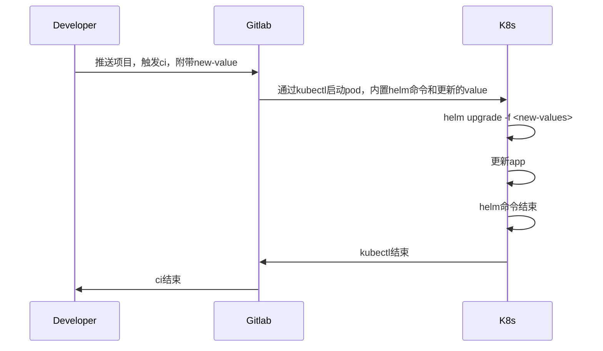

### 文档简述

该文档记录 k8s 连接 gitlab 相关的内容

### 连接方式对比

- 目前的连接方式区别

|          方式          |      版本      |
| :--------------------: | :------------: |
|   gitlab managed app   | 13.12 开始弃用 |
| cluster magage project |   14.5 之前    |
|      gitlab agent      | 14.5 开始使用  |

- 当前 gitlab 版本 13.12 ，选用`cluster manage project`方式管理 cluster.
- [配置管理项目](https://docs.gitlab.com/13.12/ee/user/clusters/management_project.html)
- [application 安装](https://docs.gitlab.com/13.12/ee/user/clusters/applications.html#install-using-gitlab-cicd-deprecated)

### 时序

- cluster magae project



### 目前的连接项目

[cluster-management-project](https://repo.wolwobiotech.com/frontend/cluster-management)

### 报错日志

当 gitlab 安装 APP 失败后，可以查询的一些日志

- runner 的日志

```
$ kubectl get events -n gitlab-managed-apps
```

- k8s 的日志，使用命令

```
$ kubectl get events -n gitlab-managed-apps
$ kubectl logs -n gitlab-managed-apps <pod_name>
```

- gitlab 的日志，使用命令

```
$ ssh gitlab-server
$ cd /var/log/gitlab/gitlab-rails
$ tail api_json.log
```

### 注意事项

- 在安装`gitlab-management-app`的 runner 前，需要先安装一个其他版本的 runner，来触发`cluster-management`项目`ci`的第一次运行。
