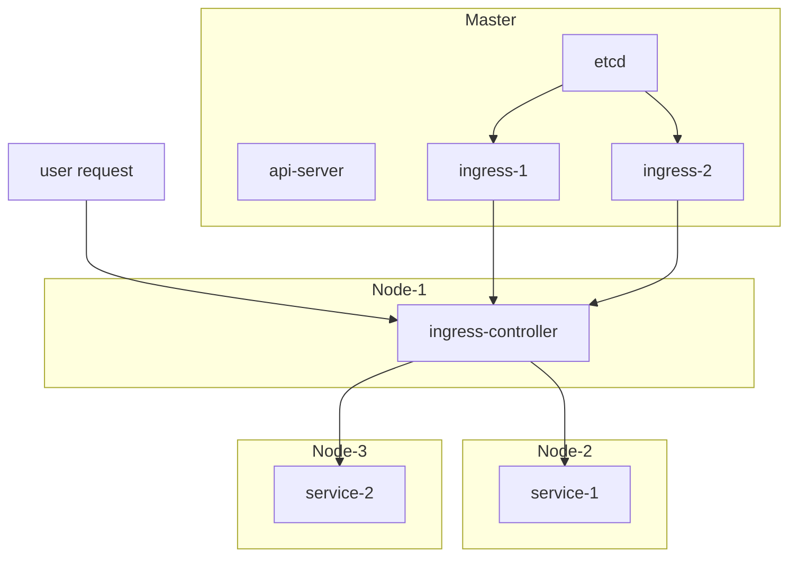

### Ingress 介绍

Ingress 为 K8S 中业务的对外入口程序，负责连接输入请求和后端服务。

### 结构

- ingress 有两个组成部件，分别为`ingress resource`(未找到官方名称)和`ingress controller`
- `ingress controller`是负责加载和解析其他的`ingress resource`，然后翻译成自己的路由，当用户请求时，发送给后端服务
- K8S 中允许存在多个`ingress-controller`，此时在`ingress resource`中需要指定`ingress class`表示需要被哪个`ingress controller`来加载

- [官方参考](https://kubernetes.io/zh-cn/docs/concepts/services-networking/ingress/)
- [目前使用的 Ingress](https://github.com/helm/charts/tree/master/stable/nginx-ingress#configuration)

### 后续

- 提升当前`nginx ingress`的版本，当前版本已经不维护更新了
