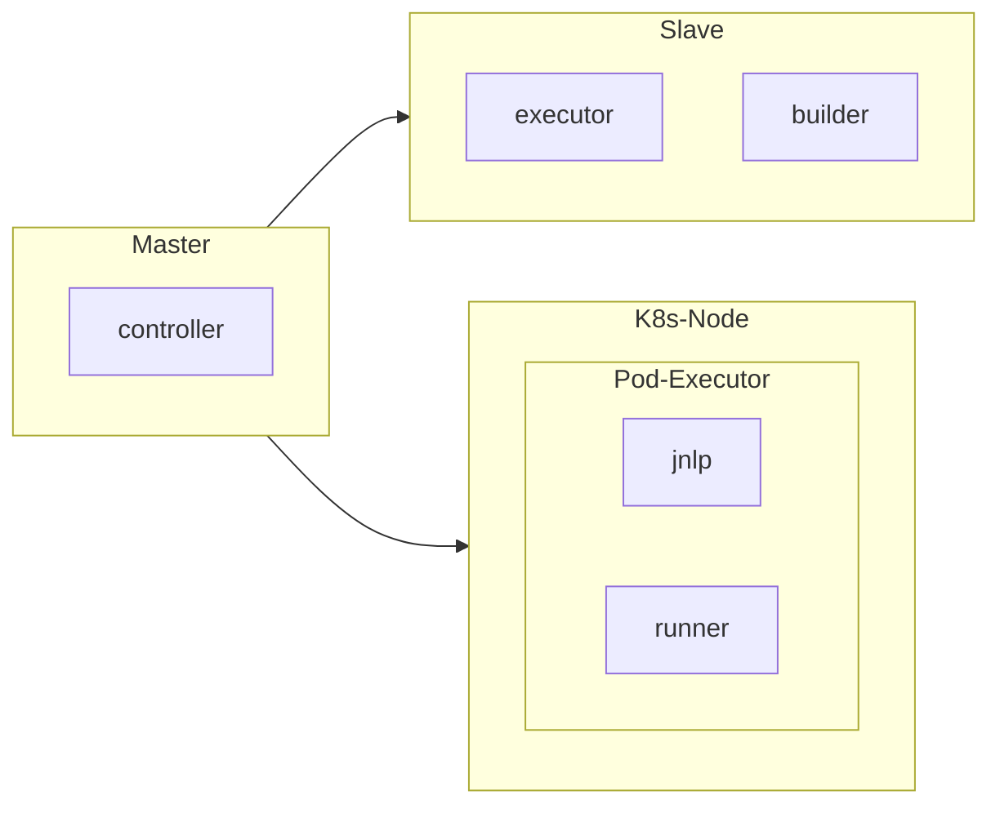

### jenkins 运行组件

|    组件    |                                    职责                                    |
| :--------: | :------------------------------------------------------------------------: |
| controller |         中央调控，分配任务等，需要一台计算机，或者虚拟机，或者 pod         |
|   slave    | 从节点，负责接受任务，分配自己的执行器执行，需要是计算机，虚拟机，或者 pod |
|  executor  |    执行任务，本身只是一个程序，可以在 slave 中，也可以在 controller 中     |
|    jnlp    |      远程启动用的程序，用于 controller 和 slave 的通信，位于 slave 中      |



### 插件列表

|         插件          |                                  功能                                  |
| :-------------------: | :--------------------------------------------------------------------: |
|      kubernetes       |                 用于在 k8s 上自动生成伸缩的 slave 节点                 |
|        gitlab         | 允许 jenkins 获取 gitlab 的代码推送情况和回推给 gitlab 代码 build 情况 |
|      gitlab api       |                     其他 gitlab 系列插件的 api 库                      |
| gitlab authentication |          提供 gitlab 系列插件的 accesstoken 等方式的验证功能           |
|      gitlab logo      |             加个 gitlab 项目上的 icon 到 jenkins，方便辨认             |
|     gitlab source     |                                                                        |

### 附录

- [文档](https://kubernetes.io/docs/reference/generated/kubernetes-api/v1.21/)
- [Scaling Docker with Kubernetes](https://www.infoq.com/articles/scaling-docker-with-kubernetes/)
- [Kubernetes plugin](https://plugins.jenkins.io/kubernetes/)

### 待解决问题

- 流水线定义无法复制粘贴操作
- jenkins 重启后，kubernetes 的配置有时会失效
- 用一个 pod 来安装 jenkins cli

### 排查过程

- 查看系统日志

  1. 方式一
     进入 jenkins 的 web 页面，点击`dashboard` --> `Manage jenkins` --> `System Log`
  2. 方式二

  ```bash
  // 排查jenkins日志
  $ k logs -n jenkins jenkins-0 jenkins
  ```

- 排查 k8s event
  ```bash
  // 排查event
  $ k get events -n jenkins --sort-by=lastTimestamp
  ```
- 排查 docker 容器
  ```bash
  $ k get pods -n jenkins -o wide | grep jenkins-0 //获取容器对应的node
  $ k get node -o wide //获取jenkins所在node的ip
  $ ssh jenkins-node
  $ docker ps -a | grep jenkins //获取jenkins的pod所在容器
  $ docker logs jenkins-container-id
  ```
