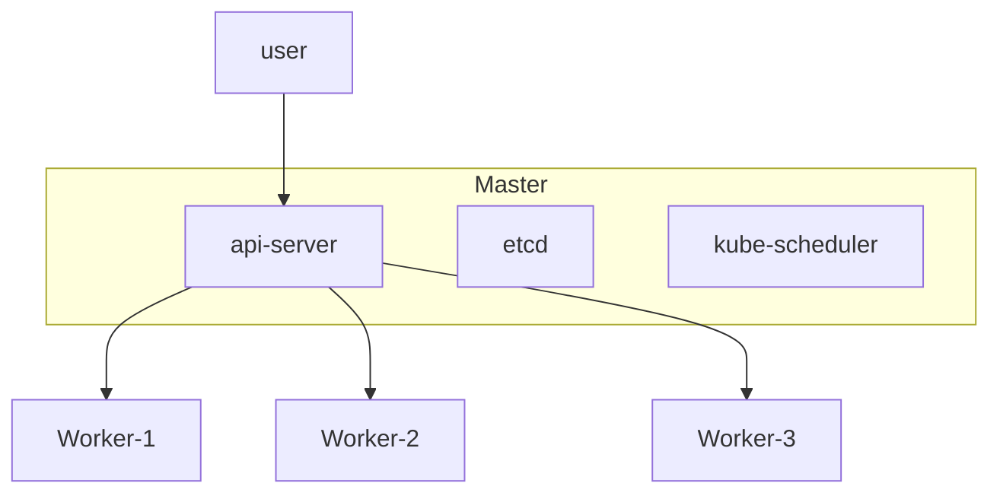

## k8s 构成组件相关

|           组件            |                                       作用                                       |
| :-----------------------: | :------------------------------------------------------------------------------: |
|          `node`           |                           k8s 的节点，一般是一台计算机                           |
|       `master node`       |          主节点，控制平面节点，一般负责 k8s 相关的服务，不负责具体业务           |
|       `worker node`       |                            工作节点，负责具体业务执行                            |
|     `kube-apiserver`      |                          控制平面组件，负责处理 k8s api                          |
|          `etcd`           |                             控制平面组件，k8s 数据库                             |
|     `kube-scheduler`      |                    控制平面组件，负责 pod 删除，创建，调度等                     |
| `kube-controller-manager` |               控制平面组件，负责监控 pod 调度情况，任务执行情况等                |
|        `container`        | 满足[CRI](https://kubernetes.io/zh-cn/docs/concepts/architecture/cri/)规范的容器 |
|           `pod`           |                                    容器的集合                                    |
|         `ingress`         |                       用作路由与分发，下面连接多个 service                       |
|   `ingress-controller`    |                         实际运行 ingress 分发逻辑的 pod                          |
|         `service`         |        服务，对于一个服务，可以有多个 pod 提供，但是每个 pod 功能必须相同        |
|       `deployment`        |                          定义 pod 和 ReplicaSet 的集合                           |
|       `replicaset`        |                           定义 pod 模板 和 pod 的集合                            |
|       `statefulSet`       |                              定义 pod 和 pv 的集合                               |
|        `DaemonSet`        |                         定义每个 node 上都需要运行的 pod                         |
|           `Job`           |                                 一次性运行的 pod                                 |
|         `CronJob`         |                               定时可重复执行的 Job                               |
|           `pv`            |                                  卷 ，类似硬盘                                   |
|           `pvc`           |                              卷申领 ，类似挂载指令                               |
|      `storage class`      |                              存储类 ，类似硬盘类型                               |

### 整体结构

### 附录

- bash 自动补全拓展
  - [bash-completion](https://github.com/scop/bash-completion)
  - [配置](https://kubernetes.io/zh/docs/tasks/tools/included/optional-kubectl-configs-bash-linux/)
  - 关于 `nginx-ingress` 无法安装的问题，提示无法找到`IngressClass`或者没有`v1beta1`的`API`，降级`k8s`版本到`1.22`以前。
  - [update-with-ingress-nginx](https://kubernetes.io/blog/2021/07/26/update-with-ingress-nginx/)
  - [ingress-nginx](https://kubernetes.github.io/ingress-nginx/)
  - [minio-helm](https://github.com/minio/minio/tree/master/helm/minio)
  - [cd 策略介绍](https://harness.io/blog/continuous-verification/blue-green-canary-deployment-strategies/)
  - [k8s trouble shooting](https://learnk8s.io/troubleshooting-deployments)
