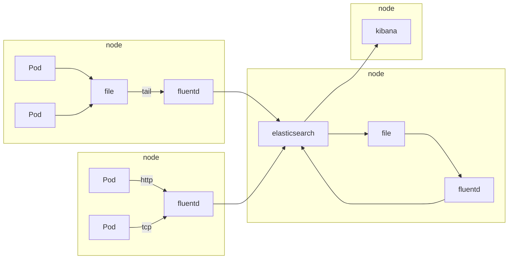
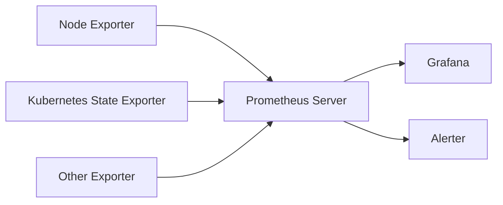

### EFK 的架构



- `fluentd` 是一个日志收集工具，可以收集各种日志，并配置一定的管道，发送到目标服务器中。
- `fluentd`基本配置说明

```xml
<!-- 收集从端口24224传输的数据 -->
<source>
  @type forward
  port 24224
</source>

<!-- 收集从端口9880传输的http数据包 -->
<source>
  @type http
  port 9880
</source>

<!-- 收集tag位myapp开头的数据，并存储到/var/log/fluent/access中  -->
<!-- @type用于确定输出用的插件 -->
<match myapp.*>
  @type file
  path /var/log/fluent/access
</match>

<!-- filter用于刷选和修改数据，例如： -->
<!-- 传入数据 -->
<!-- {"message":"hello world!"} -->
<!-- 传出数据 -->
<!-- {"message":"hello world!", "hostname":"db001.internal.example.com", "tag":"foo.bar"} -->
<filter foo.bar>
  @type record_transformer
  <record>
    hostname "#{Socket.gethostname}"
    tag ${tag}
  </record>
</filter>

<!-- system 标签用于设置系统参数 -->
<system>
  # equal to -qq option
  log_level error
  # equal to --without-source option
  without_source
  # ...
</system>

<!-- label标签用于标记给定入口分流，和@label一起使用完成跳转 -->
<label @SYSTEM>
  <filter var.log.middleware.**>
    @type grep
    # ...
  </filter>
  <match **>
    @type s3
    # ...
  </match>
</label>
```

- `elasticsearch` 是一个`Elastic`系列的数据库，用于存储 fluentd 收集到的数据
- `kibana` 是一个集成的监控平台，用于从`elasticsearch`中读取数据，完成刷选数据，分析数据，绘制图标等功能。
- `kibana query language`事例：

```sql
-- 特定词查询
http.response.status_code:400 401 404

-- 合并查询
response:200 and (extension:php or extension:css)

-- 范围查询
account_number >= 100 and items_sold <= 200

-- 时间范围查询
@timestamp < now-1d
@timestamp < "2021-01-02T21:55:59"

-- 通配符查询
machine.os*:windows 10
machine.os:win*

```

### Peometheus 的架构



## PromQL 基本用法

在 Prometheus 的表达式语言中，表达式或子表达式包括以下四种类型之一：

- 瞬时向量（Instant vector） - 一组时间序列，每个时间序列包含单个样本，它们共享相同的时间戳。也就是说，表达式的返回值中只会包含该时间序列中的最新的一个样本值。而相应的这样的表达式称之为瞬时向量表达式。
- 区间向量（Range vector） - 一组时间序列，每个时间序列包含一段时间范围内的样本数据。
- 标量（Scalar） - 一个浮点型的数据值。
- 字符串（String） - 一个简单的字符串值。

```sql
-- 查询http_requests_total所有时间序列上的值
http_requests_total
-- 等价于
http_requests_total{}
-- 选择指标名称为 http_requests_total，job 标签值为 prometheus，group 标签值为 canary 的时间序列
http_requests_total{job="prometheus",group="canary"}
```

- [参考](https://prometheus.fuckcloudnative.io/di-san-zhang-prometheus/di-4-jie-cha-xun/basics)
