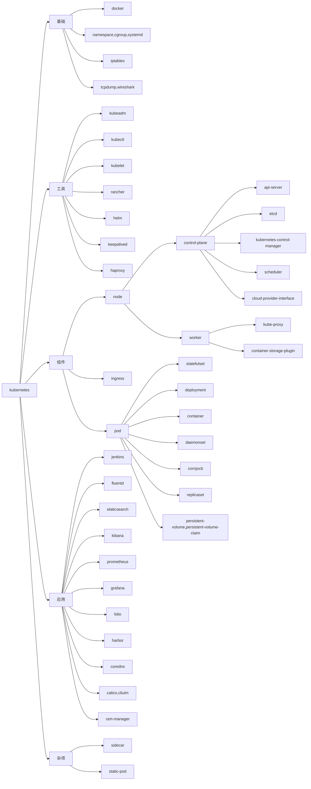

### 学习路线图

```mermaid
flowchart LR
  kubernetes --> 基础
  基础 --> docker
  基础 --> namespace,cgroup,systemd
  基础 --> iptables
  基础 --> tcpdump,wireshark

  kubernetes --> 工具
  工具 --> kubeadm
  工具 --> kubectl
  工具 --> kubelet
  工具 --> rancher
  工具 --> helm
  工具 --> keepalived
  工具 --> haproxy

  kubernetes --> 组件
  组件 --> node
  node --> control-plane
  control-plane --> api-server
  control-plane --> etcd
  control-plane --> kubernetes-control-manager
  control-plane --> scheduler
  control-plane --> cloud-provider-interface
  node --> worker
  worker --> kube-proxy
  worker --> container-storage-plugin
  组件 --> ingress
  组件 --> pod
  pod --> statefulset
  pod --> deployment
  pod --> container
  pod --> daemonset
  pod --> cornjocb
  pod --> replicaset
  pod --> persistent-volume,persistent-volume-claim

  kubernetes --> 应用
  应用 --> jenkins
  应用 --> fluentd
  应用 --> elaticsearch
  应用 --> kibana
  应用 --> prometheus
  应用 --> grafana
  应用 --> lstio
  应用 --> harbor
  应用 --> coredns
  应用 --> calico,cliuim
  应用 --> cert-manager


  kubernetes --> 杂项
  杂项 --> sidecar
  杂项 --> static-pod

```
