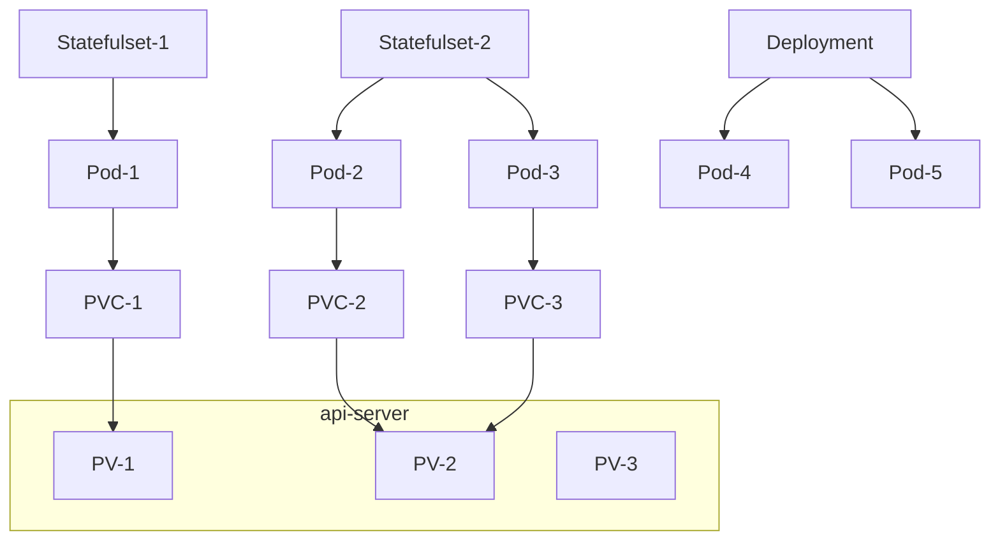
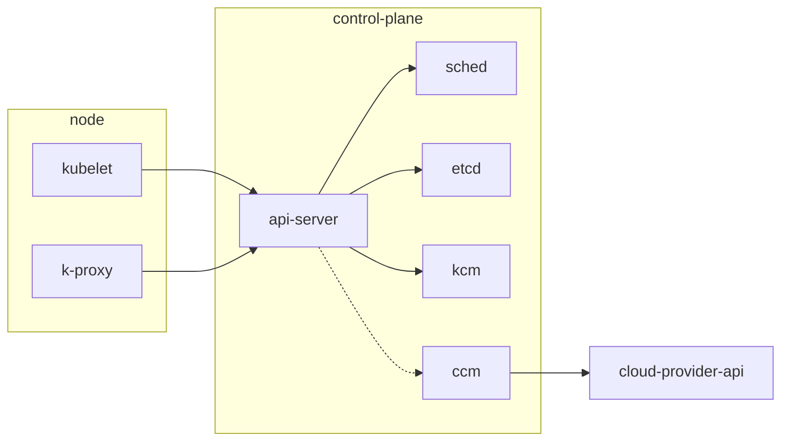

### 概念

|          项目          |    别名    |                                 意义                                 |
| :--------------------: | :--------: | :------------------------------------------------------------------: |
|           pv           |     卷     |                       相当于 pod 的持久化存储                        |
|          pvc           | 持久卷申领 |                  pod 用于向 k8s 描述需要的 pv 参数                   |
|     storage class      |   卷类型   |                     用于区分不同类型的 pv 供应商                     |
|         卷插件         |            |             用于供应卷内容，由各个服务器商提供的驱动程序             |
|     vsphere volume     |            |                    k8s 树内驱动的一种，目前已弃用                    |
|          csi           |            | 为了规避树内驱动需要改动源码的问题，开发的卷供应模块，类似于插件系统 |
|          cpi           |            |                 k8s 中的 pod 用于响应 pvc 和对接 csi                 |
| vSAN，VMFS，NFS，vVols |            |                            vMware 数据源                             |

### 结构

- [ccm](https://kubernetes.io/docs/concepts/architecture/cloud-controller/)
- [cpi](https://cloud-provider-vsphere.sigs.k8s.io/)
- [csi](https://kubernetes.io/blog/2019/01/15/container-storage-interface-ga/)



### 配置基本流程

- [安装教程](https://cloud-provider-vsphere.sigs.k8s.io/tutorials/kubernetes-on-vsphere-with-kubeadm.html)

### 其他相关文档

- [storage class](https://kubernetes.io/zh/docs/concepts/storage/storage-classes/#storageclass-%E8%B5%84%E6%BA%90)
- [FlexVolume 与 csi](https://segmentfault.com/a/1190000021651770)
- [vsphere csi](https://docs.vmware.com/en/VMware-vSphere-Container-Storage-Plug-in/2.0/vmware-vsphere-csp-getting-started/GUID-C44D8071-85E7-4933-83EA-6797518C1837.html)

### TODO

- 替换 CSI 和 CPI 中使用的账号，现在使用的是管理员账号，应当开设对应权限，开设新的专用账号。[所需权限](https://docs.vmware.com/en/VMware-vSphere-Container-Storage-Plug-in/2.0/vmware-vsphere-csp-getting-started/GUID-0AB6E692-AA47-4B6A-8CEA-38B754E16567.html)

- 自动化的编排虚拟机

### 后续补充

- KCM (Kubernetes Controller Manager)

作用是同步 K8S 的资源状态，对于所有的资源 K8S 存在两种状态，现实状态和目标状态。当两种状态出现不同时，KCM 负责进行 Diff 判断，并创建删除转移 Job，Pod 等，来达到现实状态和目标状态的一致。

- CCM (Cloud Controller Manager)

KCM 的云厂商版本，架构如下，解释见 CPI 部分。



- CPI (Cloud Provider Interface)

最初，云厂商支持 k8s 的代码都在 k8s 自身的代码库中，称为`in-tree`，后来处于维护的需要，k8s 暴露接口给云厂商，云厂商做自己的实现，接口规范称为`CPI`，云厂商自己的实现称为`CCM`，这种模式称为`out-tree`。

- CSI (Container Storage Interface)

最初，容器编排系统需要持久化卷时，需要管理员自己来配置。后来，CSI 组织制定了规范，持久化卷的供应商（云厂商）做接口实现，并实现自己的驱动，通过 API 来配置持久化卷。

### 关于 CPI 与 CSI 出错排查

- 错误排查和 K8S 的错误排查方法类似

```bash
### 排查K8S的事件
$ k get events -n <target_namespace>

### 排查csi节点的log
$ k get pods -n vmware-system-csi -o wide #查找出故障主机对应的csi节点
$ k logs -n vmware-system-csi vsphere-csi-node-<xxxx> node-driver-registrar
$ k logs -n vmware-system-csi vsphere-csi-node-<xxxx> vsphere-csi-node

### 排查csi controller的log

$ k logs -n vmware-system-csi vsphere-csi-controller-<xxxx>
$ k logs -n vmware-system-csi vsphere-csi-controller-<xxxx>
```

- 常见的错误：
- 磁盘未挂载(Volume XXXXXX not attached)，可能原因有未设置虚拟机的 `disk.EnableUUID=TRUE` ，`vsphere-csi-node`节点运行状态出现错误

### 后续

- 持久化卷的定时备份工作，如果人工操作失误，可能导致数据的丢失，例如`helm uninstall`可能会让`statefullset`的数据丢失
