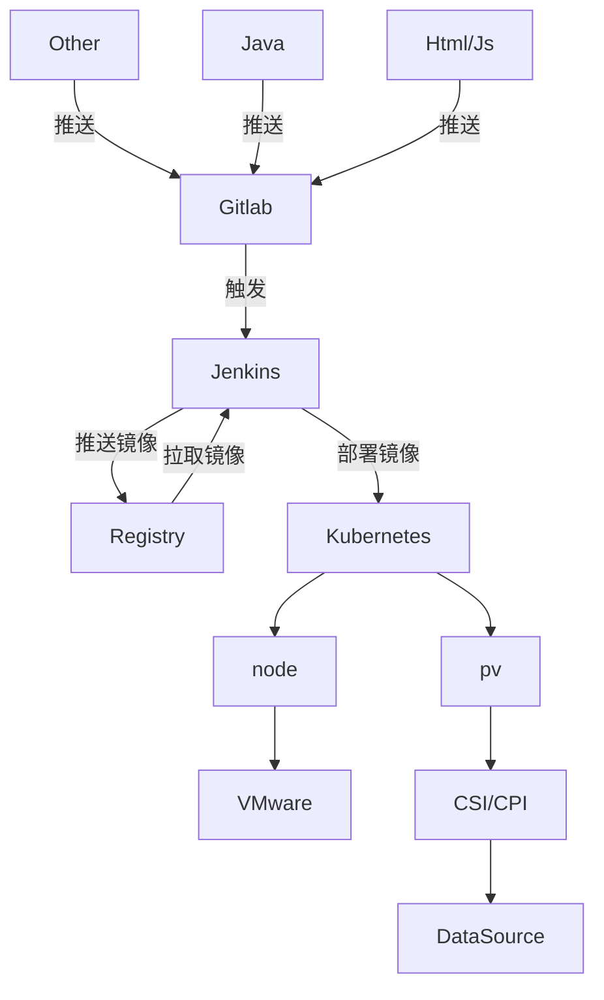
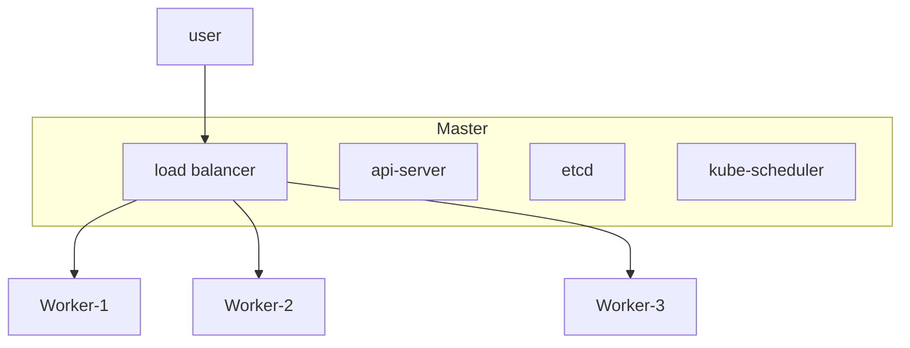
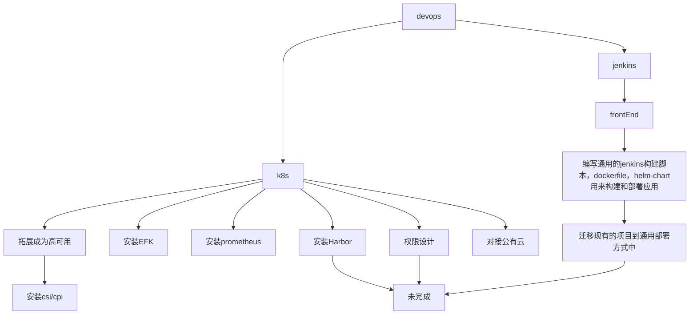

### 1. 大体框架

### 2. K8s 基本结构

- node 之间结构(非 HA)

### 3. F&Q

- 为什么使用`jenkins`而不使用`gitlab`？

jenkins 可控性比较好，稳定，gitlab 的 devops 部分更新非常频繁。
按照目前情况来看，jenkins 可以做到编译与代码仓库的分离，编译的配置文件不需要存在工程中，有利于岗位职责划分。另外 jenkins 依靠插件平台，可以配置 gitlab 无法做到的一些事情。
如果无需做到岗位划分，即开发=devops=测试=部署，则可以使用 gitlab。

- `gitlab`+`jenkins`的情况下，`ci`由谁负责？

按照上述推导，小型项目的`ci`由 gitlab 负责，大型项目的`ci`由 jenkins 负责。

- 为什么使用`k8s`?

`k8s`同类产品中的最出名的是`openshift`。
`openshift`本身基于`k8s`，有更加严格的安全策略，具体表现在，`openshift`上运行的容器对`root`运行有严格的限制。`openshift`本身具备功能更完善的`web ui`。`openshift`可以理解为自带`jenkins`。
`k8s`本身更加灵活，基础。

### 4.参考文档

- [Kubernetes 官网](https://kubernetes.io/)
- [维护 Kubernetes 用项目](https://repo.wolwobiotech.com/frontend/cluster-management)

### 5.后续

