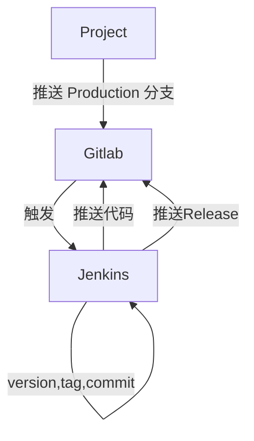
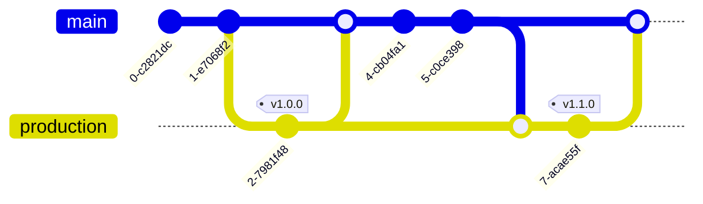
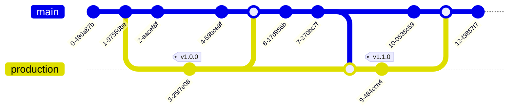
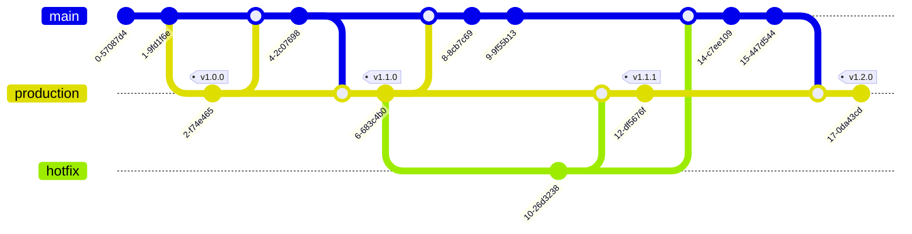

### 目的

将项目发布生产和项目打 tag 强绑定，实现每一次发布生产必定进行一次 tag 标记。

### 实现

1. 项目设置

|                 设置                  |               备注                |       用途       |
| :-----------------------------------: | :-------------------------------: | :--------------: |
|                webhook                | Gitlab 项目中设置，项目推送后触发 |  jenkins 触发器  |
|             GITLAB_TOKEN              |            gitlab 验证            | semantic-release |
|              GITLAB_URL               |            gitlab 地址            | semantic-release |
|  GIT_AUTHOR_NAME，GIT_COMMITTER_NAME  |           提交者的名字            | semantic-release |
| GIT_AUTHOR_EMAIL，GIT_COMMITTER_EMAIL |           提交者的邮件            | semantic-release |
|             jenkins 秘钥              |   gitlab jenkins 账户的账号密码   |   git 推送代码   |

2. demo 项目

- [jenkins](https://k8s-jenkins.wolwobiotech.com/job/test-jobs/job/jenkins-nodejs-demo/)
- [gitlab](https://repo.wolwobiotech.com/frontend/jenkins-nodejs-demo)

3. 运行流程

3. 可能出现的情况分析

- 常规情况

- 在 production 分支提交代码的期间有人提交代码

- 配合 hotfix 修改代码

4. 后续工作

- 环境变量使用密文保存
- 提取项目之间公用的环境变量

### 其他工作

1. 编写 `dockerfile`，该镜像需要提供上述编译过程中的运行环境，即`node`+`sematic-release`的环境
