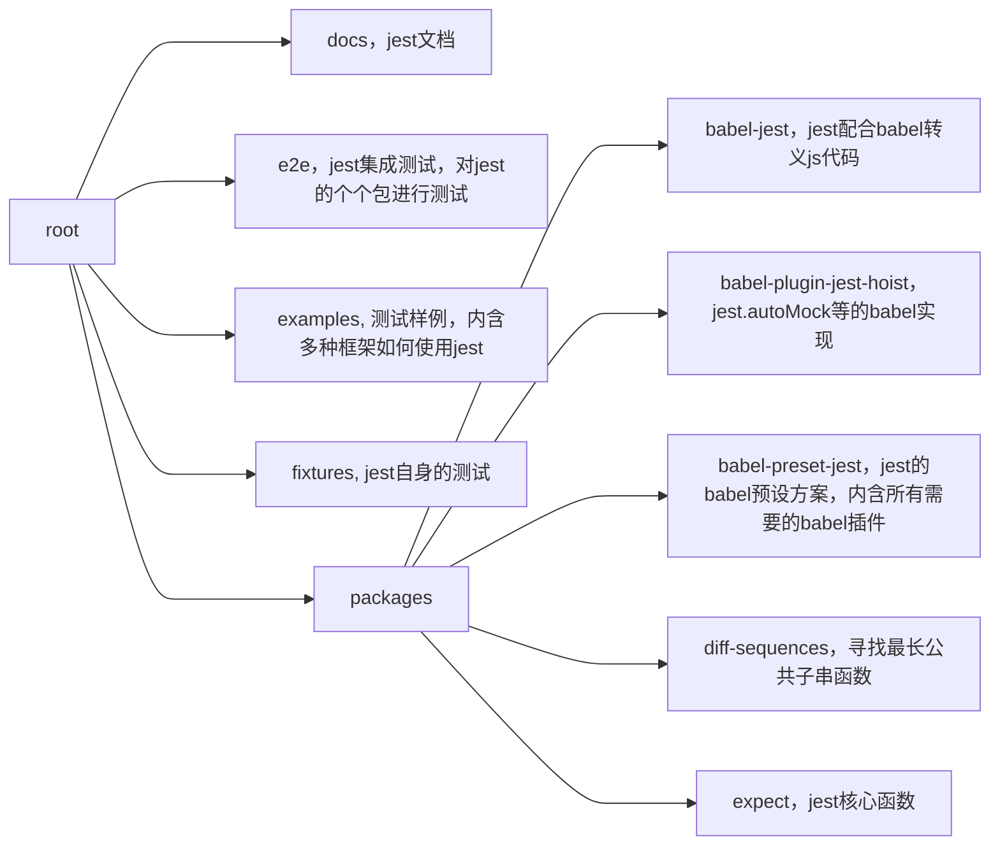

- [华夏 ERP](https://github.com/jishenghua/jshERP)，vue 开发，中小企业 erp
- [gitlab](https://github.com/jishenghua/jshERP)，可以参考 graphyql，openapi 等

## create-react-app

### 说明

cra 版本为 4.0.3，当前文档为项目总体分析，[地址](https://github.com/facebook/create-react-app)

### 目录结构

```mermaid
graph LR
  root ---> docusaurus["docusaurus，用于静态站点发布"]
  docusaurus ---> docs
  docusaurus ---> website
  root ---> packages
  packages ---> babel-plugin-named-asset-import["babel-plugin-named-asset-import，切换svg的导入方式"]
  packages ---> babel-preset-react-app["babel-preset-react-app，cra的编译配置"]
  packages ---> confusing-browser-globals["confusing-browser-globals，eslint配置，避免错误的使用global下的变量（防止漏写window.）"]
  packages ---> cra-template-typescript["cra-template-typescript，cra项目ts的模板"]
  packages ---> cra-template["cra-template，cra项目默认模板"]
  packages ---> eslint-config-react-app["cra-config-react-app，cra项目的eslint配置"]
  packages ---> react-app-polyfill["react-app-polyfill，垫片，内含最小化的浏览器支持]
  packages ---> react-dev-utils["react-dev-utils，一些帮助函数"]
  packages ---> react-error-overlay["react-error-overlay，开发环境中强制显示错误页面"]
  packages ---> react-scripts["react-scripts，react项目的配置相关，启动脚本等"]
  root ---> task["task，启动脚本"]
  root ---> test["test，e2e测试"]
```

## jest


