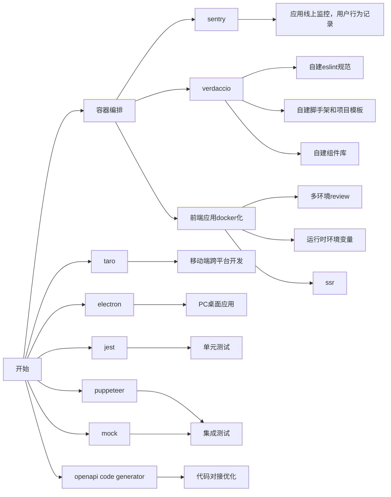

### 问题路径

```mermaid
graph LR
  开始 --> 容器编排
  开始 --> taro
  开始 --> electron
  开始 --> jest
  开始 --> puppeteer
  开始 --> mock
  开始 --> A[openapi code generator]
  容器编排 --> sentry
  容器编排 --> verdaccio
  容器编排 --> 前端应用docker化
  taro --> 移动端跨平台开发
  electron --> PC桌面应用
  verdaccio --> 自建eslint规范
  verdaccio --> 自建脚手架和项目模板
  verdaccio --> 自建组件库
  sentry --> B["应用线上监控，用户行为记录"]
  前端应用docker化 --> 多环境review
  前端应用docker化 --> C[运行时环境变量]
  前端应用docker化 --> ssr
  jest --> 单元测试
  puppeteer --> 集成测试
  mock --> 集成测试
  A --> 代码对接优化
```
